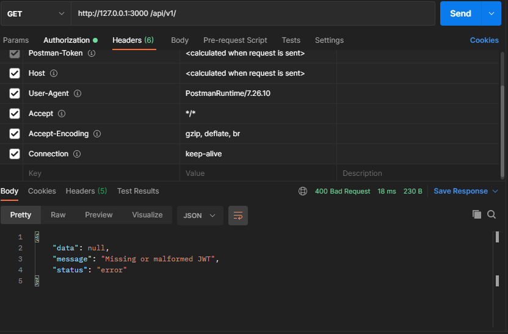
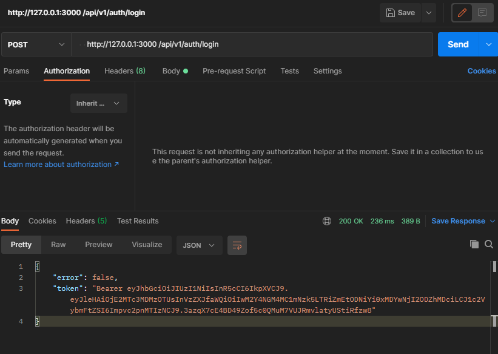
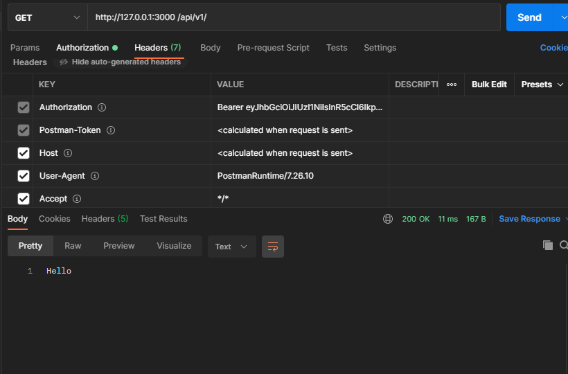

# **JWT AUTHENTICATION WITH GOFIBER**

 ### Contents

- [Introduction](#introduction)
- [Packages Used](#packages-used)
- [Images](#images)

  # Introduction
  A Rest Api  that authenticates requests using Json Web Tokens.

  > JSON Web Token is an Internet proposed standard for creating data with optional signature and/or optional encryption whose payload holds JSON that asserts some number of claims. The tokens are signed either using a private secret or a public/private key. 

  # Packages Used
  
  - [Gofiber](https://docs.gofiber.io/) -> Fiber is a Go web framework built on top of Fasthttp, the fastest HTTP engine for Go. It's designed to ease things up for fast development with zero memory allocation and performance in mind.
  
  - [Gorm](https://gorm.io//) -> The fantastic ORM library for Golang.
  - [Jwt-Go](https://github.com/dgrijalva/jwt-go)-> Used to create jwt tokens while using golang
  - [Bcrypt](golang.org/x/crypto/bcrypt) -> Used to encrypt passwords.

  # Images
   

    

    

    